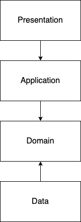

# Booky (booky)

This is a minimal example implementation of Clean Architecture in Vue/Quasar

## To-do list

- [ ] Advanced error handling (Either)
- [ ] Test-driven development
- [ ] Dependency injection
- [ ] Data mapping

## Project architecture

The project architecture consists of 4 levels: Presentation, Application,
Domain and Data (Infrastructure).



The characteristics of the layers are as follows:

- **Presentation**: This layer is basically made of UI components. The Presentation
Layer is directly coupled to the Application Layer.
- **Application**: This layer contains application logic. It knows of the Domain
Layer and the Infrastructure Layer.
- **Domain**: This layer is for domain/business logic. Only business logic lives in
the Domain layer, so there is just pure JavaScript/TypeScript code with no
frameworks/libraries whatsoever here.
- **Data**: This layer is responsible for communications with the outside
world (sending requests/receiving responses).

## Module structure

The app consists of 1 module - bookmarks.

```txt
bookmarks/
├── data/
│   └── repositories
├── domain/
│   ├── entities
│   └── repositories
├── application/
│   └── services
├── presentation/
│   ├── components
│   ├── containers
│   ├── controllers
│   ├── pages
│   ├── stores
│   └── routes.ts
└── index.ts
```

## Available scripts

### Install the dependencies

```bash
npm install
```

### Start the app in development mode (hot-code reloading, error reporting, etc.)

```bash
npm run dev
```

### Lint the files

```bash
npm run lint
```

### Build the app for production

```bash
npm run build
```

### Customize the configuration

See [Configuring quasar.config.js](https://v2.quasar.dev/quasar-cli-webpack/quasar-config-js).
